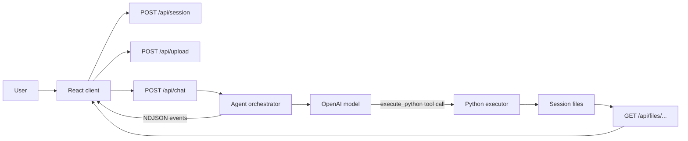

# Architecture

## Request flow

## Client

`src/app/page.tsx` creates one session when the page loads and keeps the following browser-only state:

- the session ID;
- session file list;
- run cards and their timeline/result states;
- whether an upload or run is in progress.

When a prompt is submitted, the client builds history from completed runs, then reads newline-delimited JSON from `/api/chat`. Timeline events update the active run while it executes; the final result supplies the explanation, executed code/output, and artifact list.

Layout components under `src/components/layout/` render the sidebar, file list, prompt bar, run cards, output, artifact panel, and timeline. Reusable controls are in `src/components/ui/`.

## Server

### Agent orchestration

`src/lib/agent.ts` creates a `ChatOpenAI` client and binds an `execute_python` tool schema. It supplies the model with a system prompt, prior conversation context, the new user request, and a listing of files in the current session.

The application intercepts each model tool call rather than letting LangChain execute the fallback tool directly. This lets it:

1. execute code with the correct session ID;
2. record code, stdout, stderr, duration, and success status;
3. detect created/modified files;
4. update the live execution timeline;
5. return tool results to the model so it can correct errors or explain results.

The loop permits `MAX_AGENT_RETRIES + 1` tool rounds. If it ends without a text reply, the server asks the model once to summarize the state without further tool use.

### Python execution

`src/lib/executor.ts` writes generated code to a temporary `_run_<id>.py` file in the session directory and starts Python with `-I`. It captures stdout and stderr, limits each captured stream to 20,000 characters, applies a wall-clock timeout, removes the temporary script, and compares pre/post directory snapshots to find artifacts.

Each code call starts a fresh interpreter, but files remain in the session workspace between calls. This permits multi-step analysis without keeping Python process memory alive.

### Files and sessions

`src/lib/fs-utils.ts` enforces safe session IDs, creates storage directories, manages the upload manifest, classifies artifact types, and maps files to download URLs. It operates on a flat per-session `files/` directory so generated Python can use simple relative filenames such as `pd.read_csv("sales.csv")`.
