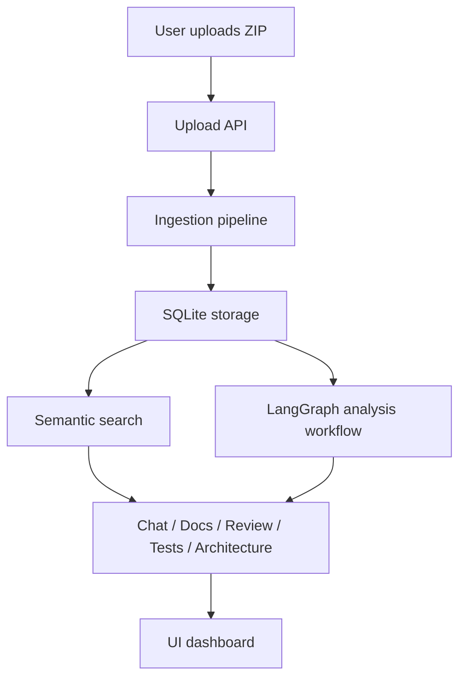

# Architecture

This project combines a web UI, a local data layer, an ingestion pipeline, and a retrieval-based AI workflow. Together, these pieces transform a ZIP archive into an interactive repository assistant.

## High-level architecture

## 1. Frontend

The frontend is a Next.js application with React and TypeScript. It provides the user experience for:

- uploading a repository,
- browsing files,
- viewing code,
- querying the repository using search and chat,
- invoking analysis modes.

The core UI components live under src/components and are arranged around a single dashboard experience.

## 2. API layer

The app router exposes server handlers under src/app/api. These endpoints are thin orchestration layers that do the following:

- validate requests,
- call the appropriate library functions,
- interact with the database,
- return JSON to the frontend.

The API layer is intentionally simple so the interesting logic remains in the shared library modules.

## 3. Ingestion pipeline

The ingestion flow is implemented in the library layer and consists of four stages:

1. extraction: the ZIP archive is read and files are discovered,
2. filtering: ignored paths and unsupported files are skipped,
3. chunking: files are split into smaller text chunks,
4. embedding and storage: chunks are embedded and written into SQLite.

This is orchestrated by src/lib/pipeline.ts.

## 4. Storage layer

The SQLite database is managed by src/lib/db.ts. It stores:

- repositories,
- files,
- chunks,
- chat messages.

The design is intentionally local and single-user friendly. The app writes the database to the data directory and uses a shared database connection for the runtime.

## 5. Search and retrieval

The retrieval layer is implemented in src/lib/similarity.ts. Its flow is:

1. embed the user query,
2. load the stored chunks for the repository,
3. compute cosine similarity between the query vector and each chunk vector,
4. return the top results.

This is a lightweight embedding search implementation that avoids needing a separate vector database for a local single-repo workflow.

## 6. Agent workflow

The AI analysis is driven by a LangGraph workflow in src/lib/langgraph. The graph contains a sequence of nodes:

- understandRequest,
- searchAndRetrieve,
- analyzeContext,
- generateResponse.

Each mode uses the same core graph structure, but the final system instruction changes depending on whether the user wants chat, docs, review, tests, or architecture output.

## 7. Data flow

A typical flow looks like this:

1. The user uploads a ZIP archive.
2. The upload endpoint calls the ingestion pipeline.
3. Files are read and chunked.
4. Embeddings are generated with OpenAI.
5. The repository, file, and chunk records are stored in SQLite.
6. The user asks a question.
7. The query is embedded and semantically matched to chunks.
8. The matched chunks are passed into the LangGraph workflow.
9. The model generates a grounded answer with source citations.

## 8. Design choices

### Why SQLite?

SQLite is a strong fit for a local developer tool because it is easy to run, does not require a separate server, and works well for a single-user setup.

### Why LangGraph?

LangGraph provides a simple way to structure multi-step AI workflows with explicit nodes and transitions. It keeps the reasoning flow readable and extensible.

### Why a local-first architecture?

The project prioritizes simplicity and privacy. No GitHub auth, no hosted vector database, and no external service beyond the OpenAI API are required.
