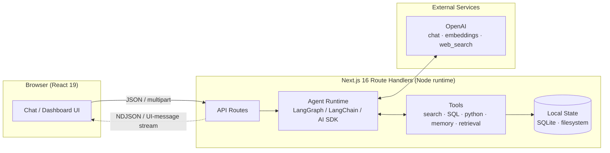

<div align="center">

# Agentix

**Eight production-grade agentic AI applications — from ReAct agents and RAG pipelines to deep research and codebase intelligence.**


</div>

---

## Overview

**Agentix** is a collection of eight full-stack agentic AI applications, each built as a complete, runnable product — not a toy demo. Every project pairs a modern **Next.js 16 / React 19 / TypeScript** frontend with a server-side agent runtime built on **LangChain v1**, **LangGraph**, or the **Vercel AI SDK**, and persists state locally with **SQLite** or the filesystem.

The projects progress deliberately in complexity: a single tool-calling agent grows into retrieval pipelines, guarded SQL execution, sandboxed code interpretation, multi-step autonomous research, persistent memory, multi-document intelligence, and finally a full repository-scale engineering assistant.

> Each project is self-contained: its own `package.json`, `.env.example`, documentation set, and runnable app. Clone once, run any of them independently.

---

## The Projects

| # | Project | What it does | Key concepts | Agent runtime |
|---|---------|--------------|--------------|---------------|
| 01 | [**First AI Agent**](01-your-first-ai-agent/) | Streaming chat agent that autonomously calls weather and calculator tools, with live tool-call cards in the UI | ReAct loop, tool calling, token streaming | LangChain v1 `createAgent` → AI SDK bridge |
| 02 | [**RAG Chat App**](02-ai-rag-chat-app/) | Upload PDF/TXT/MD documents and chat with cited, grounded answers streamed live | RAG, chunking, embeddings, vector persistence, citations | LangGraph `retrieve → generate` |
| 03 | [**SQL AI Agent**](03-ai-sql-agent/) | Ask plain-English questions over SQLite databases; get generated SQL, results, and an explanation | Tool-use agent, schema introspection, layered read-only safety | LangChain ReAct agent, 3 tools |
| 04 | [**AI Code Interpreter**](04-ai-code-interpreter/) | Upload datasets; the agent writes and executes Python, returning charts and files as downloadable artifacts | Code-generating agent, process sandboxing, artifact detection, retry loops | LangChain tool-call loop + `child_process` |
| 05 | [**Deep Research Assistant**](05-ai-deep-research-assistant/) | Decomposes a question into subtopics, researches each with live web search, and synthesizes a cited report | Planning, agentic search loops, source dedup, structured output | Vercel AI SDK + OpenAI `web_search` |
| 06 | [**Long-Term Memory Agent**](06-ai-long-term-memory/) | Chat assistant that extracts, revises, and recalls durable user memories across sessions | Memory extraction agent, semantic recall, write/read separation | Vercel AI SDK tool calling + embeddings |
| 07 | [**Document Intelligence Agent**](07-ai-doc-intelligence-agent/) | Multi-format document Q&A, comparison, structured extraction, and report generation with per-page citations | Intent routing, semantic search, structured output (Zod), multi-doc reasoning | LangGraph workflow + OpenAI |
| 08 | [**Software Engineering Agent**](08-ai-swe-agent/) | Upload a codebase ZIP; semantically search it and run chat, review, test, doc, and architecture analyses | Code chunking, repo-scale RAG, multi-mode agent, citation-to-editor UX | LangGraph + `node:sqlite` + Monaco |

---

## Architecture at a Glance

All eight apps share one runtime topology — a browser client talking to Next.js route handlers that host an agent loop with tools, storage, and an LLM:



What varies per project is the **agent pattern** inside that box:

| Pattern | Used by | Shape |
|---------|---------|-------|
| ReAct tool-calling loop | 01, 03, 04 | model ⇄ tools until final answer |
| Linear StateGraph pipeline | 02, 07, 08 | `understand → retrieve → generate` |
| Plan → execute → synthesize | 05 | planner → per-subtopic search loops → report writer |
| Dual-call memory architecture | 06 | chat call + separate extraction agent (`remember` / `revise` / `forget`) |

Deep dive: [**docs/architecture.md**](docs/architecture.md)

---

## Engineering Highlights

- **Real agent loops, not wrappers** — tool-call interception, retry/self-correction on tool errors, step caps, and structured stop conditions.
- **Two streaming protocols implemented from scratch** — NDJSON event streams (progress, sources, timeline steps) and Vercel AI SDK UI-message streams, each with a custom client-side parser.
- **Cost-aware RAG** — embeddings persisted in SQLite and rehydrated into an in-memory vector store on boot; documents are never re-embedded.
- **Defense-in-depth SQL safety** — a SELECT-only validator layered over a driver-level `readonly` connection, with allowlist-based database resolution.
- **Explicit memory architecture** — the chat model can never write memories; a separate extraction agent owns all writes via `remember` / `reviseMemory` / `forget` tools, with semantic retrieval injected into the system prompt.
- **Structured output everywhere it matters** — Zod schemas for tool inputs, research plans, and extraction results (`zodResponseFormat`).
- **Grounded, cited answers** — numbered source lists are built server-side so the writer model can only cite what it was actually given.
- **Local-first storage** — `better-sqlite3` and `node:sqlite` with WAL mode, foreign keys, and parameterized queries throughout. No hosted vector DB required.

---

## Tech Stack

| Layer | Technology |
|-------|-----------|
| Framework | Next.js 16 (App Router, route handlers, Node runtime) |
| UI | React 19, Tailwind CSS 4, shadcn-style components, Radix/Base UI primitives, Monaco (08) |
| Agent frameworks | LangChain v1 (`createAgent`), LangGraph (`StateGraph`), Vercel AI SDK 7 |
| Models | OpenAI GPT-5.x family (configurable per project), `text-embedding-3-small`, hosted `web_search` |
| Validation | Zod 4 (tool schemas, request bodies, structured output) |
| Storage | SQLite (`better-sqlite3`, `node:sqlite`), filesystem session workspaces |
| Docs/Parsing | `pdf-parse`, `mammoth`, `papaparse`, JSZip |
| Language | TypeScript (strict) end-to-end |

---

## Repository Structure

```text
agentix/
├── 01-your-first-ai-agent/          # ReAct agent + tool calling + streaming UI
├── 02-ai-rag-chat-app/              # Document RAG with cited answers
├── 03-ai-sql-agent/                 # Natural-language SQL with safety layers
├── 04-ai-code-interpreter/          # Python-writing agent with artifact output
├── 05-ai-deep-research-assistant/   # Plan → search → cited report
├── 06-ai-long-term-memory/          # Persistent memory across sessions
├── 07-ai-doc-intelligence-agent/    # Multi-document Q&A / compare / extract / reports
├── 08-ai-swe-agent/                 # Repository-scale code intelligence
└── docs/                            # Bundle-level documentation
    ├── architecture.md              # Overall architecture & design patterns
    ├── getting-started.md           # Prerequisites, env matrix, quick starts
    └── project-guides.md            # Per-project guide index & concept map
```

Every project also carries its own `docs/` folder with overview, architecture, API reference, and project-structure guides.

---

## Quick Start

Prerequisites: **Node.js 20.9+** (22.5+ for project 08), an **OpenAI API key**, and **Python 3** (project 04 only).

```bash
# pick any project
cd 02-ai-rag-chat-app

# install & configure
npm install
cp .env.example .env.local   # add your OPENAI_API_KEY

# run
npm run dev                  # http://localhost:3000
```

Full per-project setup, environment variable matrix, and troubleshooting: [**docs/getting-started.md**](docs/getting-started.md)

---

## Documentation

| Doc | Contents |
|-----|----------|
| [docs/architecture.md](docs/architecture.md) | Overall system architecture, the four agent patterns, streaming protocols, storage & safety design |
| [docs/getting-started.md](docs/getting-started.md) | Prerequisites, per-project env vars, install/run commands, troubleshooting |
| [docs/project-guides.md](docs/project-guides.md) | Index of every project's own documentation with the concepts each one teaches |

---

## Notes

- All projects are **local-first and single-user** by design; no auth or rate limiting is included.
- An OpenAI API key is required for every project (chat + embeddings; web search in 05).
- Projects 01–07 share the current LangChain v1 / AI SDK 7 generation; project 08 intentionally demonstrates the same patterns on the classic LangGraph 0.2 API.

---

<div align="center">
Built by <a href="https://github.com/varadharajaan">Varadharajaan</a> · For portfolio and educational use
</div>
