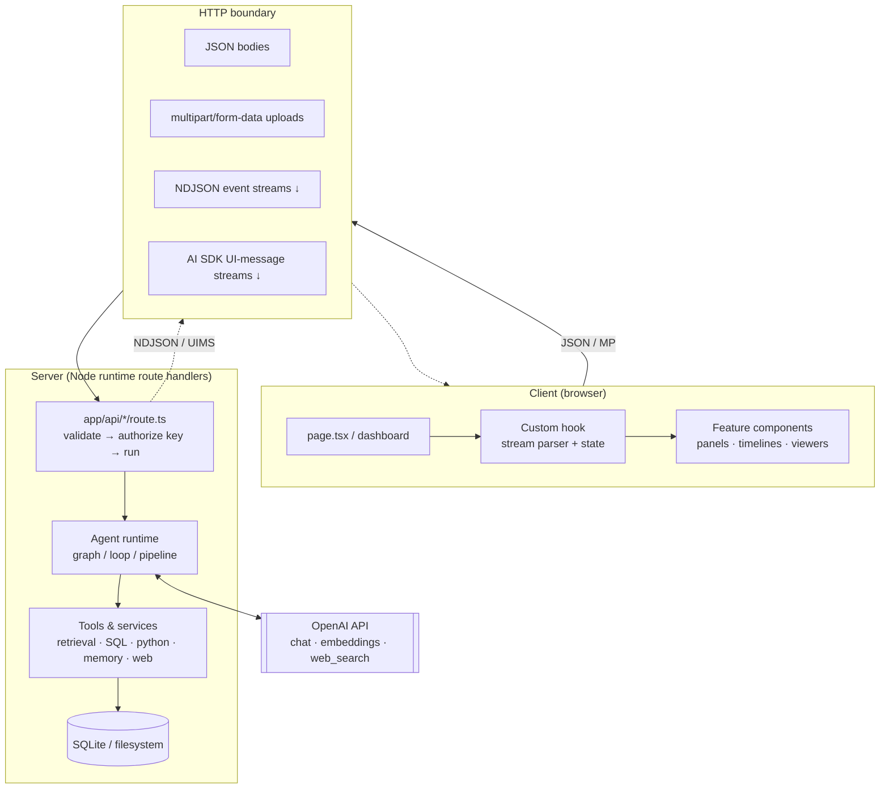
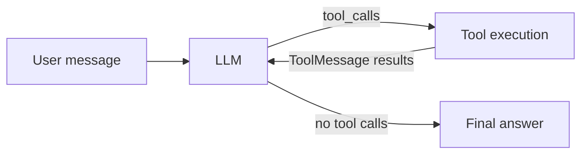
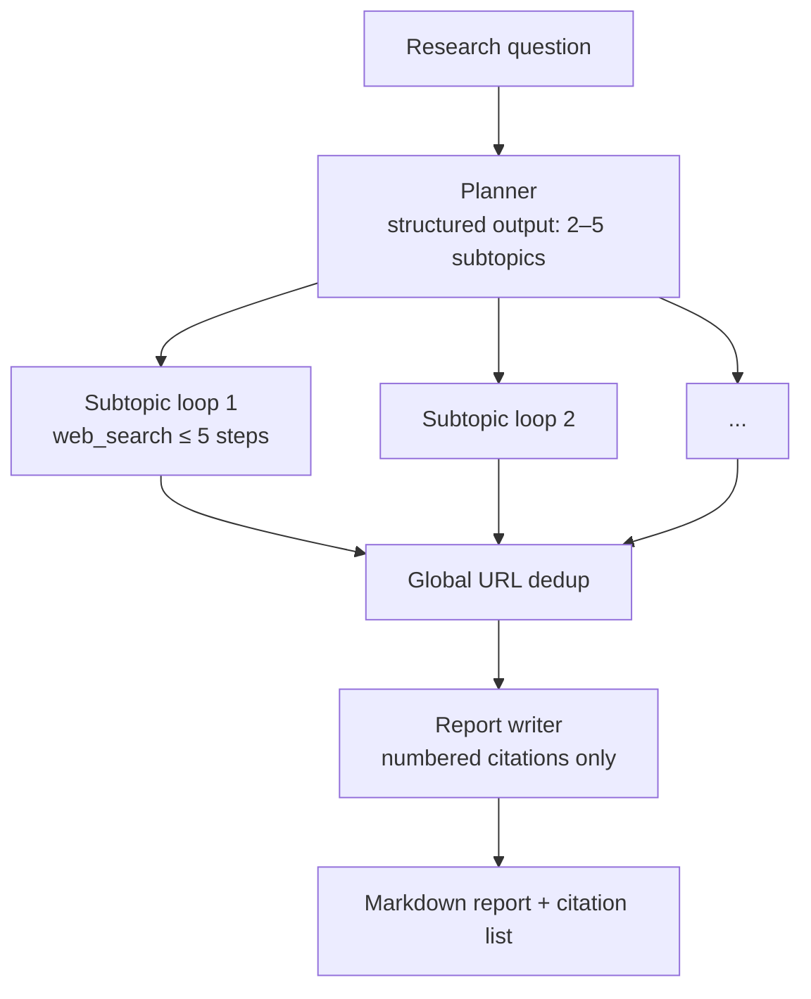
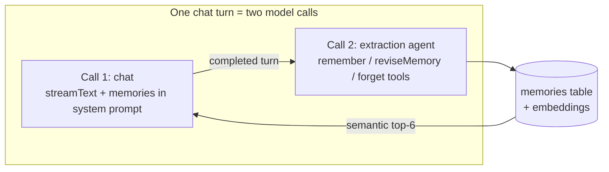

# Agentix — Overall Architecture

This document describes the architecture shared by all eight projects in the bundle, the four agent patterns they implement, and the design decisions that recur across them. For per-project internals, follow the links into each project's own `docs/` folder.

---

## 1. Shared Runtime Topology

Every project is a self-contained **Next.js 16 App Router** application with the same three-tier shape:

Recurring conventions:

- **`runtime = "nodejs"`** on routes that touch native modules (`better-sqlite3`, `child_process`) or the filesystem.
- **Server-only secrets** — `OPENAI_API_KEY` is read only in server modules; clients never see it.
- **Zod at the boundaries** — request bodies, tool inputs, and structured model outputs are all schema-validated.
- **Thin routes, fat libs** — route handlers validate and delegate; all logic lives in `lib/` (or `src/lib/`), which keeps the agent runtime testable and UI-agnostic.
- **Local-first persistence** — no hosted database or vector store anywhere; everything runs against local SQLite files or per-session folders.

---

## 2. The Four Agent Patterns

### 2.1 ReAct tool-calling loop — projects 01, 03, 04

The model alternates between reasoning and tool calls until it produces a final answer.

- **01** uses LangChain v1's prebuilt `createAgent` (a two-node LangGraph loop under the hood) with `get_weather` and `calculator` tools, bridged to the Vercel AI SDK for UI-message streaming.
- **03** closes tools over a specific database path per request (`createSQLAgentTools(databasePath)`), so one deployment can serve many databases safely. Tool errors are returned as *results*, letting the agent self-correct (max two correction attempts per the system prompt).
- **04** **intercepts tool calls instead of letting the framework execute them**: the `execute_python` tool is schema-only, and the loop runs the code itself so it can record execution attempts, diff the session directory for artifacts, and drive a live timeline — a pattern worth stealing anywhere tool side-effects need observability.

### 2.2 Linear StateGraph pipelines — projects 02, 07, 08

Deterministic graphs compiled with LangGraph's `StateGraph` + `Annotation` state (last-write-wins reducers):

- **02** is the minimal form: `retrieve → generate`, where retrieval is a `MemoryVectorStore` rehydrated from SQLite-persisted embeddings (never re-embedded).
- **07** adds regex-based intent classification (`qa | comparison | summary | extraction | search`) that changes retrieval breadth (topK 8 vs 12) and the system prompt.
- **08** adds a heuristic request-understanding node (extracts filename mentions for path-filtered retrieval with unfiltered fallback) and a context-analysis node that labels chunks with relevance scores before generation.

### 2.3 Plan → execute → synthesize — project 05

Two anti-hallucination guards worth noting: the plan is produced via **structured output** (Zod-enforced shape, so the plan is always machine-readable), and sources are **numbered server-side before the writer call** — the report model is instructed to cite only `[n]` references it was given and to never invent a source.

### 2.4 Dual-call memory architecture — project 06

The key design rule: **the chat model can never write memory**. All writes go through a separate extraction agent whose tools execute against SQLite immediately and stream `MemoryEvent`s over NDJSON, so the UI's memory panel updates live. Retrieval is pure cosine similarity over stored embeddings (threshold 0.15, top 6), injected as bullet lines in the system prompt.

---

## 3. Streaming Protocols

Two protocols are implemented across the bundle, each with a hand-written client parser:

| Protocol | Projects | Shape |
|----------|----------|-------|
| **NDJSON event stream** | 02, 04, 05, 06 (extraction) | One JSON object per line; discriminated-union event types (`status`, `source`, `token`, `timeline`, `done`, `error`) shared between server emitter and client reducer |
| **AI SDK UI-message stream** | 01, 06 (chat) | `toUIMessageStream` / `toTextStreamResponse` consumed by `useChat` or a manual reader |

The NDJSON pattern is the bundle's workhorse for **agent observability**: pipelines emit typed events as they work (planning → searching → reading → writing), and the client folds them into progress timelines, source panels, and live run cards. Client parsers use a `ReadableStream` reader + `TextDecoder` with buffered line-splitting to handle chunk boundaries correctly.

---

## 4. Storage & Retrieval Design

| Project | Store | Retrieval |
|---------|-------|-----------|
| 02 | `better-sqlite3` (documents + chunks + JSON embeddings) | `MemoryVectorStore` rehydrated via `addVectors` — embeddings reused, never recomputed |
| 03 | `better-sqlite3`, opened `{ readonly: true }` | n/a (schema introspection via `sqlite_master` + `PRAGMA table_info`) |
| 04 | filesystem (`data/sessions/<uuid>/`) | n/a (artifact detection via mtime snapshot diffing) |
| 06 | `better-sqlite3` (memories + JSON embeddings) | in-JS cosine scan, threshold 0.15, top 6 |
| 07 | `better-sqlite3` (documents, chunks, embeddings, conversations, messages) | in-JS cosine scan, topK 8–12 |
| 08 | `node:sqlite` (repos, files, chunks with float32 BLOB embeddings) | in-TS cosine scan, topK 10–12, optional path pre-filter |

Common traits: **WAL mode**, **foreign keys with cascade deletes**, **parameterized statements everywhere** (no SQL injection surface), and dev-safe singleton connections via `globalThis` guards to survive Next.js hot reloads.

The deliberate trade-off: full-table cosine scans in TypeScript instead of a vector database. At portfolio scale (thousands of chunks) this is fast, removes all infra, and keeps every project `npm install`-and-run.

---

## 5. Safety & Guardrail Design

| Layer | Project | Mechanism |
|-------|---------|-----------|
| SQL validation | 03 | `validateSQL`: single-statement enforcement, `^SELECT` gate, denylist (`INSERT|UPDATE|DELETE|DROP|ALTER|CREATE|...`) |
| Driver-level read-only | 03 | every connection opened `{ readonly: true }` — an independent backstop if the validator is bypassed |
| Allowlist resource resolution | 03, 04, 08 | clients send *names/IDs*, never paths; servers resolve against on-disk allowlists |
| Process isolation (best-effort) | 04 | `python -I`, scrubbed child env, 20 s wall-clock timeout + SIGKILL, 20 KB output caps |
| Grounding prompts | 02, 05, 07, 08 | "answer only from these excerpts", server-numbered citations, "never invent files/sources" |
| Upload hygiene | 03, 04, 07, 08 | extension allowlists, size caps, filename sanitization, in-memory-only extraction |

Honest scope note: these are **single-user, local-first apps**. There is no authentication, rate limiting, or quota enforcement anywhere, and project 04's Python execution is process-level isolation only (not a container). Each project's docs enumerate the hardening steps required before multi-user deployment.

---

## 6. Cross-Cutting Design Decisions

1. **TypeScript strict, end-to-end** — shared discriminated-union event types (`ChatEvent`, `ResearchEvent`, `MemoryEvent`) give compile-time safety across the HTTP streaming boundary.
2. **Errors as data inside agent loops** — tools return `{ success: false, error }` objects instead of throwing, which lets agents self-correct rather than crashing the run.
3. **Optimistic UI with reconciliation** — chat bubbles render before the stream completes; `done` events reconcile drift; deletes update local state immediately.
4. **Docs as a first-class artifact** — every project ships overview / architecture / API-reference / project-structure docs, kept in lockstep with the code.
5. **Configurable models via env** — every model name is an env var with a code default, so the entire bundle can be repointed (e.g. to a different OpenAI-compatible endpoint) without code changes.

---

## Where to Go Next

- Per-project deep dives: [project-guides.md](project-guides.md)
- Setup and environment matrix: [getting-started.md](getting-started.md)
- Bundle overview: [../README.md](../README.md)
